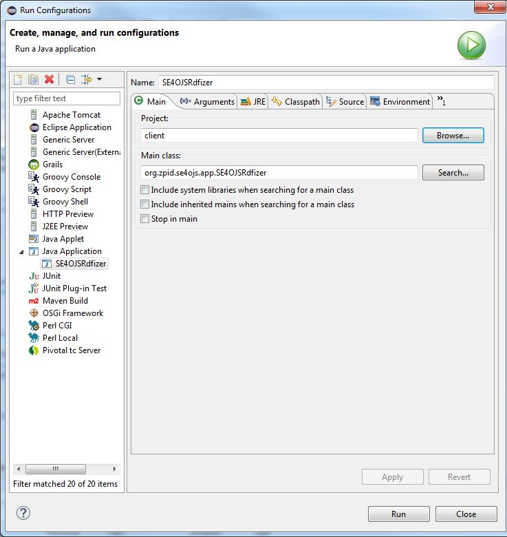
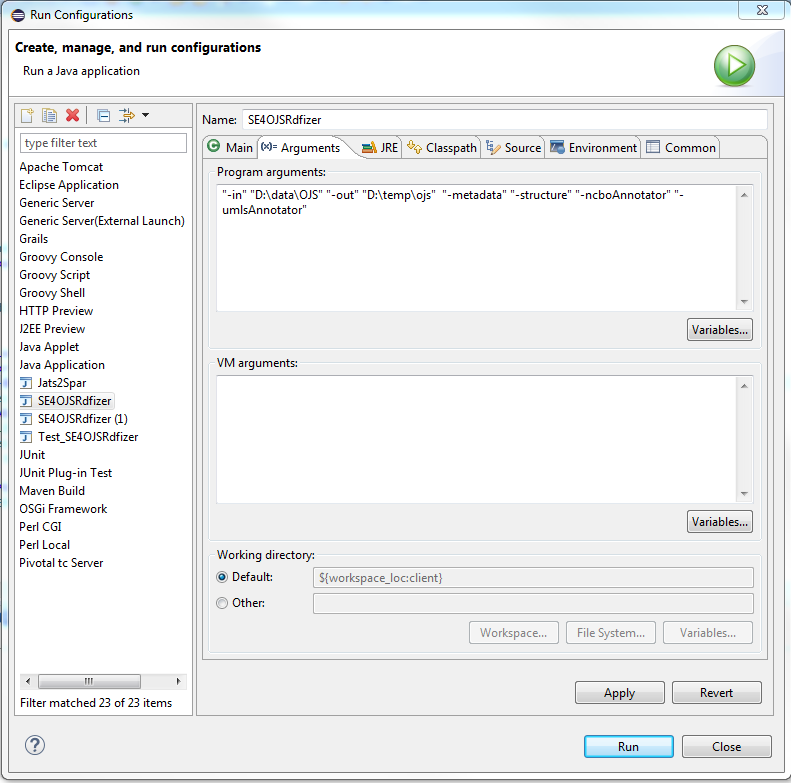

## KOBPSY ##
An RDF-knowledgebase for scholarly articles in psychology. The RDF representations have been generated from the articles' JATS-XML representations using the SE4OJS tool (see description below).  

- Article metadata, such as title, authors, keywords, references etc.

- article text structure, such as sections, paragraphs, paragraphs' textual content and in-text citations have been rdfized and the
- textual content has been semantically annotated with ontologies from bioportal and the UMLS using the **SE4OJS** tool (see description below). 

A sample of 5 articles and their RDF-representations from KOBPSY is available at: /se4ojs/resources/data/annotation.zip.

## SE4OJS User documentation ##
### Overview
The application consists of several modules, rdfizing different aspects of an xml article in JATS- 1.0 format, using a variety of ontologies, especially the [SPAR ontologies](http://sempublishing.sourceforge.net/ "SPAR ontologies") and the [Annotation Ontology](https://code.google.com/p/annotation-ontology/ "Annotation Ontology"). It was inspired by the [Biotéa](http://www.jbiomedsem.com/content/4/S1/S5) project with whom it shares similarities in workflow and output.
#####Modules
-	**client-module:** Acts as a controller, steering the  
workflow. Contains the main class "SE4OJSRdfizer".
- **jats2Spar-module:** RDFizes the article  metadata. Uses an XSLT-Stylesheet (based on: [*Peroni, S. Lapeyre D.A., and Shotton D. (2012). From Markup to Linked Data: Mapping NISO JATS v1.0 to RDF using the SPAR (Semantic Publishing and Referencing) Ontologies*](http://www.ncbi.nlm.nih.gov/books/NBK100491/)) to transform the xml into rdf.
   Produces an rdf file in the output directory, containing article metadata representations, e.g. on article identifiers, journal, issue, article title, keywords, article contributors, their affiliations, article references and their authors.
- **textStructure-module:** RDFizes the textual structure, i.e. sections, paragraph, paragraph text and in-text citations. Produces the in-text citation count for each reference. Outputs a second .rdf-file to the output directory containing this information.
- **annotation-common-module:** Contains shared classes used by all content-annotation components.
- **annotation-ncbo-module:** Automatically annotates the textual content of the article with user-defined bioportal ontologies, using the [NCBO annotator web-service](http://data.bioontology.org/documentation#nav_annotator). Creates an annotation context, relating the concept to the text location where it occurs. Keeps track of the frequency of occurrence of each concept. Outputs a third rdf-file containing this information.
- **annotation-umls-module:** Automatically annotates the textual content of the article with user-defined UMLS ontologies, using the [java api](http://metamap.nlm.nih.gov/JavaApi.shtml) of the [MetaMap](http://metamap.nlm.nih.gov/) tool. It is a prerequisite to running this module that an accessible MetaMap server is running (if installed on another machine, the code must be adapted, since the MetaMap server location is not user-configurable yet). Produces the same annotations and output like the annotation-ncbo module.
- **common-module:** Contains important user configuration files. Also contains resources and classes used by more than one project.

### General Notes  
All rdfization steps are optional. But there are some constraints due to a dependency: Annotators depend on the text-structure rdfization step.
The annotators try to ignore text in other languages than English. This is achieved by checking whether the section or paragraph containing the text has a language attribute-value that specifies another language than English. Once such an attribute-value is encountered, the annotator skips this textual element including all its child-elements.   
###Project Setup###

- Currently, no user interface or packaged binary is offered for download – the sources need to be compiled and the program must run from either command-line or an IDE. 
- The project consists of several maven modules -> make sure maven is installed on your machine to compile the projects
- SE4OJS requires Java7
#####Running SE4OJS

- **Main class**. The entry point, i.e. the main method to run the application is *se4ojs\sources\client\src\main\java\org\zpid\se4ojs\app\SE4OJSRdfizer.java*
- Possible **commandline-arguments** are:

	-  `“-in” “path/to/dir”`	, *mandatory*. Input directory containing the JATS-xml Files (Version 1.0). The directory only processes .xml files. It may contain other files or nested directories, (e.g. the pdf representations of the articles) which will be ignored. A path to a single file is also possible.

	- `“-out” “path/to/dir”`	, *mandatory*. Output directory for the generated rdf-files

	- `“-metadata”`, *optional*. Rdfizes article-metadata (calls the jats2Spar module). Produces an rdf file in the output dir containing article metadata representations.

	- `“-structure”	`, *optional*;*mandatory if annotators are also specified*. Rdfizes the text structure. Produces an rdf file in the output dir containing article metadata representations, in text citations and citation frequency information for references.
	- `“-ncboAnnotator”`		Optional; must be used in conjunction with “-structure”
	
	- `“-umlsAnnotator”`	MetaMap must be set up and 	Optional; must be used in conjunction with “-structure”
- **Configuration Reference**
	  The main configuration file is located at:  
    *common/src/main/resources/config.properties*
     
	- **Article language** (comma-separated list of  ISO 639 2 or character language codes). Articles in other languages are skipped and are not being processed.   Example: `languagesIncluded=en,de,fr`
	- **Base URI** (Base URI for all persistent and non-persistent URIs required for the creation of rdf-resources)  
	Example: `baseUri=http://www.zpid.de/resource`

	- **NCBO annotator**. You need to acquire an API-key in order to access the annotator. The url of the annotator service is configured and the ontologies that shall be used to annotate the textual content need to be specified.
	   *Example*:  
    `ncbo.service.url=http://data.bioontology.org/annotator`  
    `ncbo.apikey=*[your API-key here]*` 
    `ncbo.annotator.ontologies=ONTOAD,NIFSTD,GALEN,SIO,BIOMO,AURA,RADLEX`
	- **UMLS annotator**.   
	If the program is run with the UMLS Annotator, the version of the UMLS used for the UTS Web Services and a list of ontologies for annotation have to be specified.
       *Example*: 
         `umls.version.uts=2014AB` 
          Process only these vocabularies with UMLS MetaMap; 
          The comma-separated list must not contain any spaces 
          `umls.annotator.ontologies=MSH,PSY,NCI,HL7V3.0,RCD,LNC,CSP,ICNP` 
  	- **Concept Linking**.     
 It is possible to match UMLS metathesaurs concepts extracted by the UMLS Annotator to the corresponding BioPortal concepts (which will considerably increase processing time and size of the rdf-files).
    For this, more configuration options in the main configuration file must be present: 
    The flag for concept matching must be set to "true". UMLS user name and password to access the UTS-WebService, which will fetch the "Atom"-concept from the source vocabularies for each Metathesaurus concept found by MetaMap and the base-URI of the metathesaurus concepts in the UMLS Metathesaurus Browser. Respectively, the base URI for the NCBO concepts used by the bioportal ontology browser must be provided.
      *Example*: 
    `umls.addNcboConceptUris=true` 
   `umls.username=yourUsernameHere` 
   `umls.password=yourPasswordHere` 
   `umls.baseConceptUri=https://uts.nlm.nih.gov//metathesaurus.html` 
   `ncbo.baseConceptUri=http://bioportal.bioontology.org/ontologies/` 
   - In addition to these properties in the main configuration file, an ontology configuration file for concept linking exists at:
   *common/src/main/resources/ontologyNameMappings_Ncbo_Umls.txt*
   This additional configuration file is necessary since the naming of the NCBO browser URIs do not follow any hard rules and may vary across different bioportal ontologies, depending on the URI scheme the ontology submitter had chosen. There is one line per ontology. The line is a comma-separated list. 
   The following information must be specified for each ontology:
      - ontologyName               : human-readable name of the ontology
      - NCBO abbreviation          : abbreviation for this ontology used by Bioportal
      - UMLS abbreviation          : abbreviation for this ontology used by the UMLS
      - bioontology ontology URL   : The bioportal browser URL for this ontology (this might vary from the one used as part of the concept ID)
      - concept separator in URI   :The separator used between the ontology base URL and an individual concept, as in `http://ncicb.nci.nih.gov/xml/owl/EVS/Thesaurus.owl#C16326`
      - concept prefName (P) or code (C): frequently, either the preferred label of a concept is used as the concept ID or the concept code, as in
        `http://ontology.apa.org/apaonto/termsonlyOUT%20(5).owl#**Behavior**` or in `http://ncicb.nci.nih.gov/xml/owl/EVS/Thesaurus.owl#**C16326**`
      - delimiter of multiword concepts: If the concept's preferred name (P) is used in the URI, ontologies vary how they separate words if a concept name consists of multiple words. Specify the delimter character here.
      Example ´_ ´
      - stopwords                   : If (P) is used: In some ontologies stopwords are omitted from preferred concept names. This is for example the case with the APAONTO-ontology. Simply state 'stopWords' in this column if this is the case, otherwise leave empty. Currently, instead of using a list of stopwords, all words with maximum length of 2 characters in a multi-word concept are ignored. This covers many, but of course not all concepts (as in "Abuse of Power".
   Example entry for mapping two ontologies:  
`APA Thesaurus,APAONTO,PSY,http://ontology.apa.org/apaonto/termsonlyOUT%2520(5).owl, %23, P, _ , stopWords`  
`Logical Observation Identifier Names and Codes terminology,	LOINC, LNC, http://purl.bioontology.org/ontology/LNC, /, C`

### Sample Setup for Eclipse
- Import the maven projects into Eclipse (first install the projects with maven from the commandline (`mvn clean:install`); run maven's eclipse plugin  `mvn eclipse:eclipse`, then import the projects into the IDE; In Eclipse Luna: `File->Import->Existing Maven projects`
- Create an Eclipse-Run-Configuration:
#####Sample Eclipse Run-configuration (includes all possible rdfization steps).

